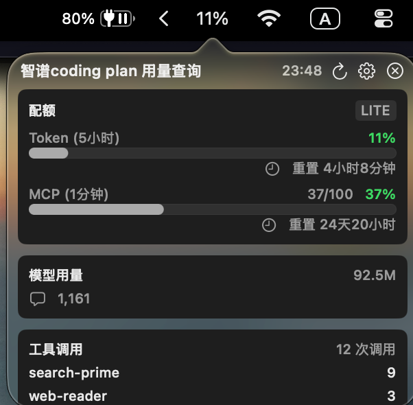

# Zai Usage Menu Bar

A native macOS menu bar app for monitoring your [ZhiPu (智谱)](https://open.bigmodel.cn) Coding Plan API usage in real time.

## Features

- **Quota Monitoring** — Track token and MCP usage quotas with visual progress bars and color-coded warnings (green/orange/red)
- **Model Usage** — View total token consumption and model call counts over the last 24 hours
- **Tool Usage** — See per-model tool call breakdowns
- **Auto-Refresh** — Data refreshes automatically every 5 minutes
- **Menu Bar Icon** — Shows current token usage percentage directly in the menu bar
- **Bilingual** — Supports English and Simplified Chinese

## Screenshot



## Requirements

- macOS 14 (Sonoma) or later
- Xcode 15+ or Swift 5.9+
- A ZhiPu API authentication token

## Build & Run

```bash
cd ZaiUsageMenuBar
swift build
swift run
```

Or open `Package.swift` in Xcode and press Cmd+R.

## Configuration

1. Click the **gear icon** in the popover header
2. Paste your ZhiPu API auth token
3. Choose your preferred language (English, Chinese, or System Default)

The app connects to `https://open.bigmodel.cn/api/monitor/usage/*` endpoints using your auth token.

## How It Works

- The app displays as a menu bar item showing the current token usage percentage
- Clicking the menu bar item opens a popover with detailed usage information
- Data is fetched from the ZhiPu monitoring API on launch and every 5 minutes thereafter
- The refresh button allows manual data refresh at any time

## License

MIT
